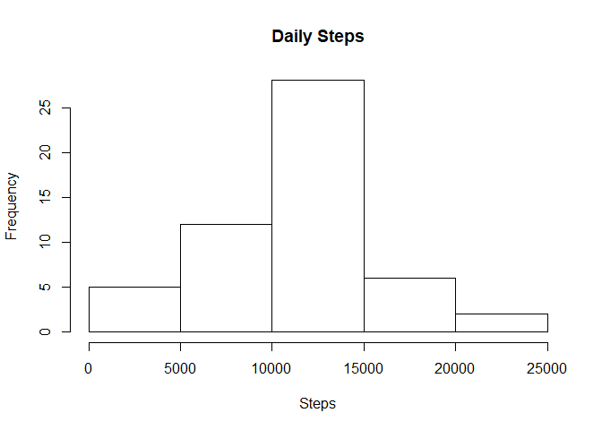
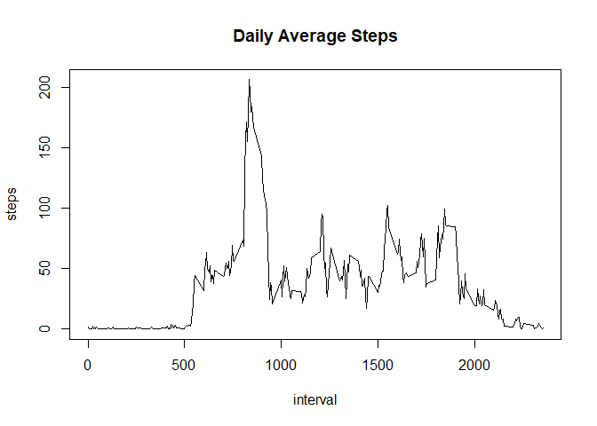
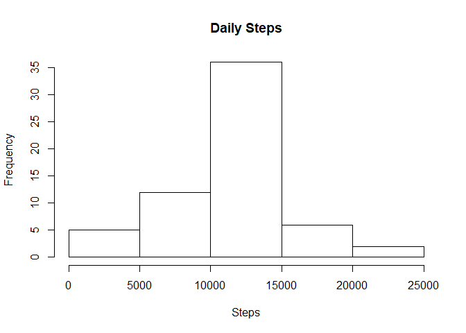
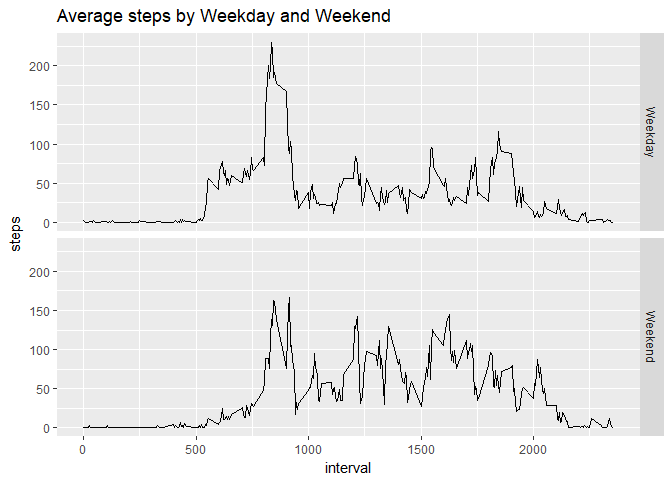

## Loading and preprocessing the data


```r
dat<-read.csv("activity.csv")
```

## What is mean total number of steps taken per day?

This is a histogram showing the total number of steps taken each day


```r
daily<-with(dat,aggregate(steps~date, FUN=sum,na.rm=TRUE))
hist(daily$steps,main = "Daily Steps", xlab = "Steps")
```

<!-- -->

```r
m1<-formatC(mean(daily$steps), format = "d", big.mark = ",")
m2<-formatC(median(daily$steps), format = "d", big.mark = ",")
```

The mean of the total number of steps taken per day is 10,766.
The median of the total number of steps taken per day is 10,765.


## What is the average daily activity pattern?
 

```r
avg<-with(dat,aggregate(steps~interval,FUN=mean))
with(avg,plot(interval,steps, type="l",main = "Daily Average Steps"))
```

<!-- -->

```r
maxint<-avg[which(avg$steps==max(avg$steps)),1]
```
 
The "835" 5-minute interval, on average across all the days in the dataset, contains the maximum number of steps.

## Imputing missing values


```r
miss<-sum(is.na(dat$steps))
missp<-paste(round(100*mean(is.na(dat$steps)), 2), "%", sep="")
```

There are 2304 missing value in the steps column, 13.11% of the total observations.

Then we will produce another dataset in which all missing values will be replaced by the average steps of each 5-minute interval across all the days. 

Here is the histogram of the processed dataset:

```r
dat2<-dat
for (i in avg$interval) {
  dat2$steps[dat2$interval==i & is.na(dat2$steps)]<-avg$steps[avg$interval==i]
}
daily2<-with(dat2, aggregate(steps~date, FUN = sum))
hist(daily2$steps,main = "Daily Steps", xlab = "Steps")
```

<!-- -->

```r
m1b<-formatC(mean(daily2$steps), format = "d", big.mark = ",")
m2b<-formatC(median(daily2$steps), format = "d", big.mark = ",")
```

The mean of the total number of steps taken per day is 10,766.
The median of the total number of steps taken per day is 10,766.

Since the missing value concentrate on the same days,  mean and median are not that much difference from the previous result. Only the frequency increased because we added back some days which contained only missing value in the original data.

## Are there differences in activity patterns between weekdays and weekends?


```r
dat2$wd<-as.POSIXlt(as.Date(dat2$date))$wday
dat2$wd2<-ifelse(dat2$wd==0 | dat2$wd==6, "Weekend", "Weekday")
avg2<-with(dat2, aggregate(steps~interval+wd2,FUN = mean))
library(ggplot2)
qplot(interval,steps,data=avg2,geom="line",facets =wd2~., main = "Average steps by Weekday and Weekend")
```

<!-- -->
           


